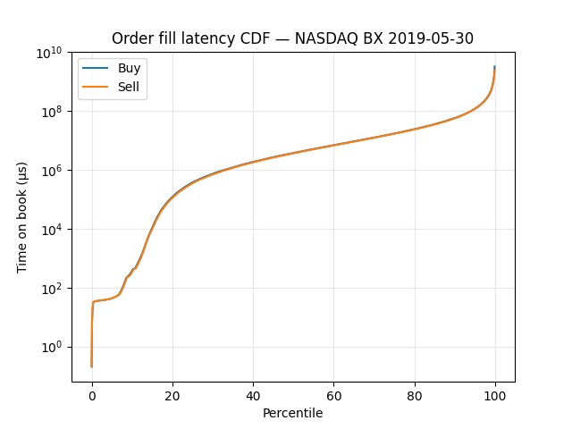
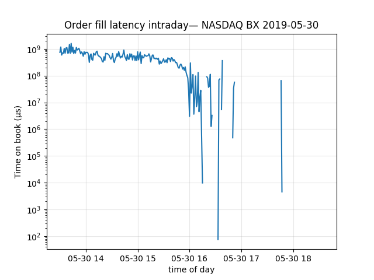

# NASDAQ ITCH Latency Analyzer

I built a latency-analysing system using parsed NASDAQ BX TotalView-ITCH 5.0 which is a 36 million+ record binary dataset. The latency was calculated as the difference between the time an order was added and the time the same order was completed or deleted. I used these latencies to build latency distributions (p50/p90/p95/p99/p99.9), also comparing the latencies for the buy and sell sides. This study is important to identify inefficiencies in exchange behavior.

## Files

- **itch_parser.py** — takes the NASDAQ dataset and parses it to create a record containing all orders along with their reference number, side, stock, time of addition and time of processing
- **dataset.py** — takes the records from itch_parser, creates a pandas DataFrame and returns a parquet file (a column-oriented binary file)
- **distributions.py** — creates latency distributions to analyse the dataset of orders
- **visualization.py** — using the distributions, creates CDF and intraday plots using matplotlib

## Key Findings

1. Sell orders filled marginally faster than buy orders at every percentile. The sell p50 was 3.7s vs buy p50 of 3.8s
2. The distribution has a heavy right tail. While p50 fill time was 3.7 seconds, p99 was ~8 minutes, meaning the slowest 1% of orders took ~130x longer than the median
3. p99 latency was highest at market open (13:30 UTC) and declined steadily through the session, collapsing sharply at market close (16:00 UTC)

## Charts

## How to Run

1. Download the data: `wget "ftp://emi.nasdaq.com/ITCH/Nasdaq BX ITCH/20190530.BX_ITCH_50.gz"`
2. Install dependencies: `pip install -r requirements.txt`
3. Build the dataset: `python3 dataset.py`
4. Compute distributions: `python3 distributions.py`
5. Visualize: `python3 visualization.py`